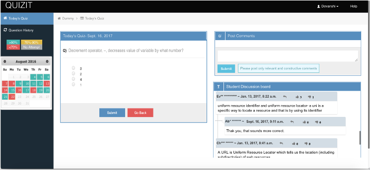
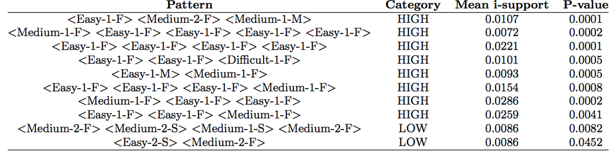

# Behavior Analytics & Modeling

 
1. [Modeling Problem-Solving Tactics](#problem-solving-tactic)
1. [Modeling Studying Persistency](#study-persistency)

**Research Platform**:

* Data: 600+ users/semester student’s attempts, time, reflection, success rate, sessions, etc.
* Learning Sciences principles:
	* Distributed practice (Rohrer, 2015)
	* Retrieval practice and testing effects (Roediger & Butler, 2011)
	* Reflection and metacognition (Hacker, Dunlosky, & Graesser, 1998; Zimmerman & Schunk, 2012)
	* Feedback (Butler & Winne, 1995; Shute, 2008)
	* Peer interaction (Roscoe & Chi, 2007; Topping, 2005)
* QuizIT design and evaluation related articles:
	*	*Alzaid, M., & Hsiao, S. (2019). [Utilising problem-solving: from self-assessment to self regulating](https://doi.org/10.1080/13614568.2019.1705922). New Review of Hypermedia and Multimedia, 25(3), 222-244.*
	*	*Alzaid, M., Trivedi, D., & Hsiao, I. H. (2017, October). [The effects of bite-size distributed practices for programming novices](https://doi.org/10.1109/FIE.2017.8190593). In 2017 IEEE Frontiers in Education Conference (FIE) (pp. 1-9). IEEE.*

**Underlying Hypotheses**:

H1: ==Students’ problem solving tactics== can be classified based on the sequences of their problem solving actions, and behavioral patterns are correlated to the performances.

H2: ==Students’ studying patterns== can be clustered as click-stream (response-stream) data, and study persistency positively affects performances.

##Modeling Problem-Solving Tactics
### Building Action Sequences
Action sequence formed by action segment {**Complexity, Correctness, Duration**}

* Complexity ∈ {Easy, Moderate, Difficult}
* Correctness ∈ {1, 2}
* Duration ∈ {F, S, M, L, VL, XL}

For instance, **==\<Easy-1-F>==** represents a question of easy difficulty that was answered correctly on the first attempt.

### Differential Sequential Mining 
Action sequence assigned to students performance by median score to split into *Higher* performing and *Lower* performing students.

Metrics to measure pattern frequency:

* s-frequency : # of sequences in a database containing a specific pattern
* i-frequency : # of times a pattern appearing in a single sequence
	* s-support >= 0.3
	* i-support considered maximum gap constraint : 2
	* p-value threshold was set at 0.05	 
	
### Feature selection & modeling
* 35 s-frequent patterns: 23 high-performing and 12 low-performing
* CFS with 10-fold CV used for feature selection (patterns in at least 5 CV included)
* 8 high-performing and 2 poor-performing patterns retrieved from CFS

### Found problem solving tactics

### Lessons Learned
> **Persistent practicing** feature consistently being important feature regardless what model it is.

###Publications

* *Mandal, P. P. (2017). Behavioral Pattern Mining and Modeling in Programming Problem Solving (Masters Thesis, Arizona State University)*

* *Mandal, P., & Hsiao, I. H. (2018). Using Differential Mining to Explore Bite-Size Problem Solving Practices. In Educational Data Mining in Computer Science Education (CSEDM) Workshop*

##Modeling Studying Persistency

###Modeling Persistence
TBA

###Behavioral Analytics on Persistence and Regularity 
TBA

###Findings
TBA

###Publications
* *Chung, C. Y., & Hsiao, I. H. (2019, October). [Quantitative Analytics in Exploring Self-Regulated Learning Behaviors: Effects of Study Persistence and Regularity](https://doi.org/10.1109/FIE43999.2019.9028665). In 2019 IEEE Frontiers in Education Conference (FIE) (pp. 1-9). IEEE.*
* *Chung, C. Y., & Hsiao, I. H. (2020, February). [Investigating Patterns of Study Persistence on Self-Assessment Platform of Programming Problem-Solving](https://doi.org/10.1145/3328778.3366827). In Proceedings of the 51st ACM Technical Symposium on Computer Science Education (pp. 162-168).*
* *Chung, C. Y., Paredes, Y. V. M., Alzaid, M., Papakannu, K. R., & Hsiao, I. H. (2020). [A Longitudinal Study on Student Persistence in Programming Self-assessments](https://ceur-ws.org/Vol-2734/paper2.pdf). In CSEDM@ EDM.*
* *Chung, C. Y., & Hsiao, I. H. (2021). [From Detail to Context: Modeling Distributed Practice Intensity and Timing by Multiresolution Signal Analysis](https://educationaldatamining.org/EDM2021/virtual/static/pdf/EDM21_paper_53.pdf). International Educational Data Mining Society.*

##Contacts
[Dr. Sharon Hsiao](https://webpages.scu.edu/ftp/ihsiao/)

