# Emerging Technology Support for Sustainability/Waste Management Learning

1. [Problems & Research Issues & Research Objectives](#problems)
1. [Educational Recycling Assistance (ERA)](#era)
	- [Waste Detector](#waste-detector)
	- [Sustainability Awareness technology](#sustainability)
	- [Augmented Reality Feedback Delivery](#ar)
- [Waste Dataset Engineering](#WasteDatasetEng)
	- [Image Augmentation & Segmentation](#augmentation)
	- [Generative AI models to supply longtailed samples](#generativeai) 
- [TPB-based EdTech for Waste Management Learning](#tpb)
- [Waste Genie: Web Application for Smart Waste Management](#webapp)
	- [Waste Genie Logos](#logo)
	- [Gamification in informal learning](#game)
- [Sustainability content generation](#AI)
- [MyEcoPal: Bridging sustainability knowledge and behavior](#myecopal) 
- [Contact](#contacts)


### <a name="problems"></a>Problems
```
* Existing information/knowledge is distributed, scattered and simply not enough.
* Daily waste is often messy.
* Every county, state, country, has slightly different recycling regulation.
* Waste is only the tip of the iceberg of environmental sustainability issue.
* Sustainability is complex, involving social, economics, and environmental dimensions. 
* Knowing is one thing, doing is another. 
```
### <a name="researchissues"></a>Research issues
```
1. Limited and biased waste datasets. 
	* Traditional image augmentation and segmentation may have limits, requires innovative methods to improve imbalance training set.
2. Limited theoretical grounded learning tools in this domain.
	* Fast changing pace in waste management.
	* Informal learning of complex social problems (location, resource, regulation).
	* Insufficiency of waste management knowledge.
		- How to learn & re-learn?
		- How to build sustainable behaviors?
		- How to transform sustainablity awareness to contribution?
3. Challenges in visualizing and contextualizing carbon consumption & emission.
	* Invisible, long-term consequential effect.
	* EPA’s Carbon footprint calculator focuses on lump sum and metrics centered events, such as commute, transportation, household, etc. but consumer-based sustainable behavioral based carbon emission conversions.
	* Embedded carbon is hard to capture or to visualize. 
4. Challenges in finding, receiving, subscribing updated information, resources, and eco-tips.
	* How can modern AI (LLM, ChatGPT, Generative AI...) help in addressing this challenge?
5. How do we bridge understanding (knowing) to actually doing (performing) sustainable actions?  

```

### <a name="objectives"></a>Research Objectives
```
* Help people navigate the complex waste management field.
* Provide emerging technologies to facilitate (lifelong, informal, sustainable) learning.
* Support sustainable practices and healthy behaviors.
* Raise sustainability awareness.
```

## <a name="era"></a>Educational Recycling Assistance (ERA) - preliminary design & studies


### <a name="waste-detector"></a>Waste Detector 

Several datasets are adopted to train the object detection model, including **TrashNet**, **Open Image Dataset** (OIDv6, for straw & plastic bags), **TACO**, and our self-built dataset (for paper and plastic objects). Additional cleaning and processing were implemented to unify the format of annotations, which resulted in 4,835 distinct images with corresponding labels. We also randomly selected some of the images for augmentation and generated 8,596 samples in our dataset. The model was trained under the **EfficientDet** and then converted to a tflite model for real-time object detection in the mobile platform. 

[Datasets and model engineering](#WasteDatasetEng) lead to another research question documented in the later section. 

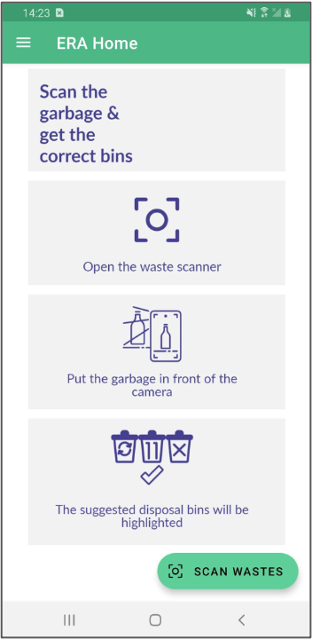
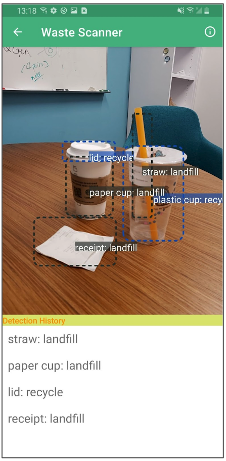
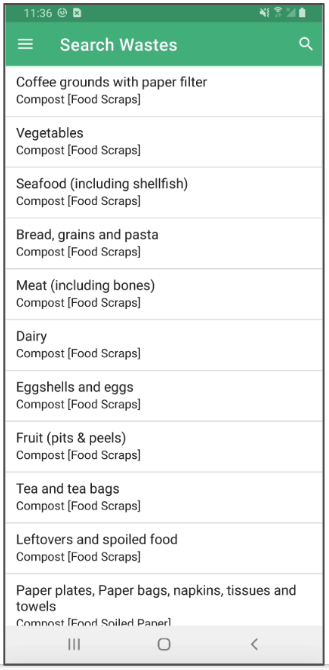


## <a name="sustainability"></a>Sustainability Awareness Technology
### Carbon Emission Calculator
While there ares everal existing published carbon calculators to help compute the equivalent amount of carbon dioxide (CO<sub>2</sub>) emissions, many of them are bundled with household or travel with a variety of input and configurations. i.e. https://www.carbonfootprint.com/calculator.aspx

Our solution utilizes the [waste detection](#waste-detector) to mimic and  simplify the abstract measurements of the amount of waste to trash and projecting an estimation of the carbon emissions. Associating the detected waste to the carbon emissions calculation avoids tedious steps of manual input and permits persistent carbon emission tracing.

### Carbon Footprint Tracer and Visualization

####Sustainable behavioral based carbon emission tracking

####Social visualization

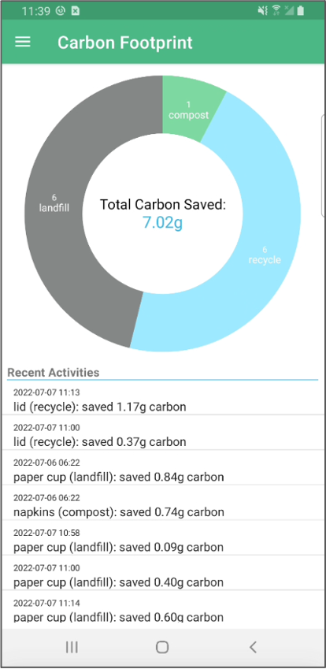  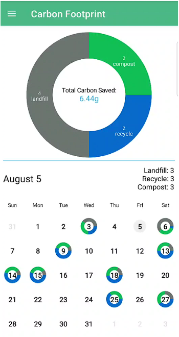

## <a name="ar"></a>Augmented Reality Feedback Delivery
In addition to the instant feedback of the detected waste & appropriate bin to dispose, we explore the immersive technology - AR to extend the information space. It provides more engaging interactions and three-dimensional space to display potential recommended information. 

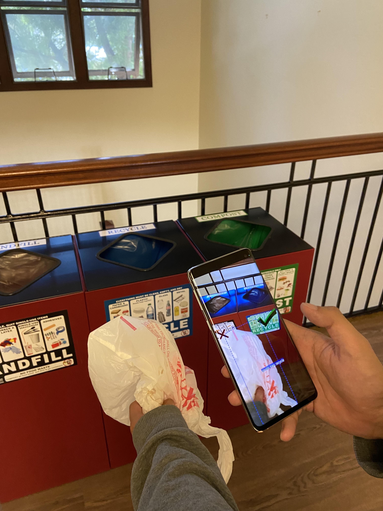 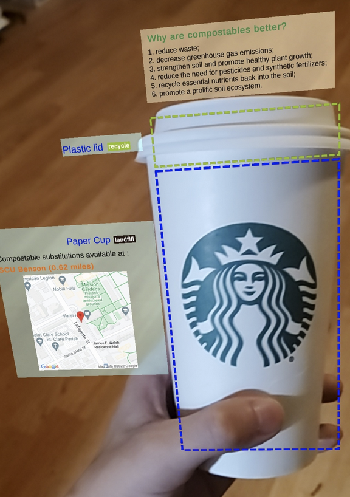

## Learning Opportunity

###Learning Tips
###Feedback
###Recommendation
Forthcoming...

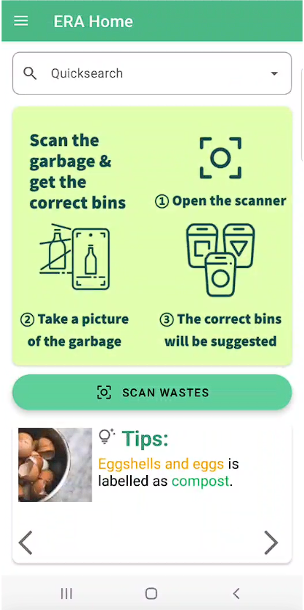

### <span style="color:blue">Lesson Learned</span>

> <span style="color:blue">We recognize the importance of *learning* content and the challenges to involve users in using the application, a more streamlined UI has to be designed to compliment and maximize all the wonderful sustainability techs that we have built. </span>

### Publication

*Sun., Q., Hsiao., I-H. & Chien., S-Y. (2023) <a href="https://doi.org/10.1007/978-3-031-47328-9_34" target="_blank">Immersive Educational Recycling Assistant (ERA): Learning Waste Sorting in Augmented Reality</a>, IEEE, the 9th International Conference of the Immersive Learning Research Network.*

*Sun, Q., Hsiao, I. H., & Chien, S. Y. (2023, July). <a href="https://doi.org/10.1007/978-3-031-36001-5_66" target="_blank">Immersive Educational Technology for Waste Management Learning: A Study of Waste Detection and Feedback Delivery in Augmented Reality.</a> In International Conference on Human-Computer Interaction (pp. 509-515). Cham: Springer Nature Switzerland.*


##<a name="WasteDatasetEng"></a>Practical Solution to Engineer *balanced* Waste Dataset

### Why are the existing datasets not enough?
> Internet crawled images can be noisy. (i.e. an image labeled as straw often is not just a straw, it usually comes with a cup, a hand and a place, etc.)
> 
> Small objects can be hard to train. 

In our previously deployed model (assembled upon open data sets, and some additions from our efforts), there is a total 55043 images, 24 categories.

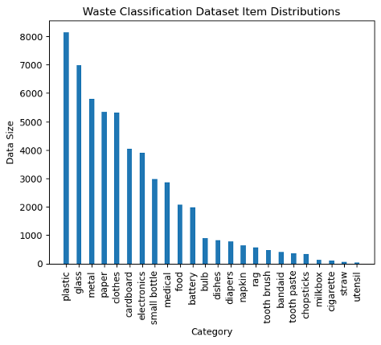 

<details>
	<summary><b>Approaches to address imbalanced data</b></summary>
	### Approaches to address imbalanced data 
####Data Expansion 1: <a name="augmentation"></a>augmentation + segmentation
1. Include more samples from OIDv7 (1), process images with detection bounding boxes
1. Blur out the area outside the target bounding box (2) / or simply cut the box off the image (3)
1. Use the generated single-object images for training

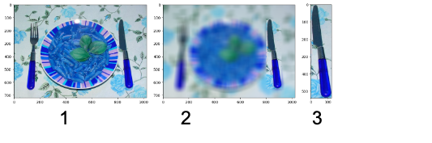 
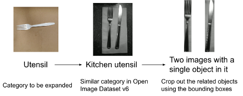 


There are still problems...
> 
* Cropping, blurring...It doesn’t guarantee imbalance data set issue. (underrepresented categories).
* Ensemble methods (AdaBoost, SMOTE) to learn from misclassification and reduce bias or to generate minority classes to rebalance the dataset.
These models may be sensitive to noise and outliers. 


####Data Expansion 2: <a name="generativeai"></a>Generative AI models to supply longtailed samples

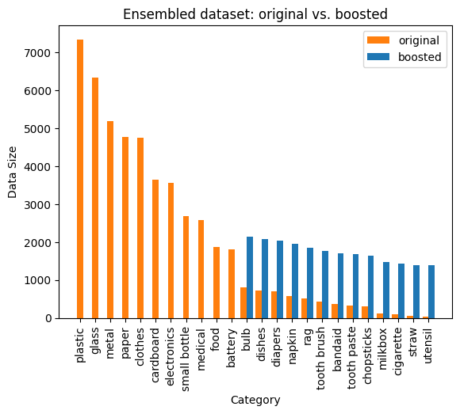 


Detail forthcoming...

</details>


### Results

* AI-boosted image categories had higher entropy. 
* AI-infused images improved the image diversity. 
* Generative-AI is more prominent in improving model accuracy with biased or imbalanced datasets.
* Cost-efficiency of the boosted data and model accurancy can be achieved. 

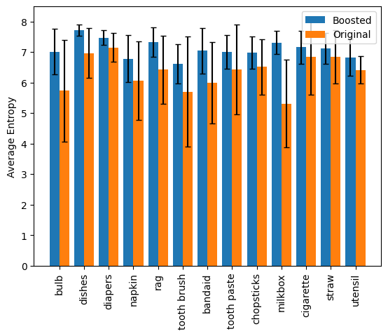 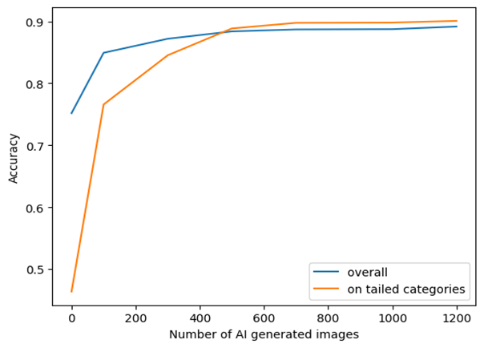 

### <span style="color:blue">Lesson Learned</span>

<details>
	<summary><b>Existing Open Datasets</b></summary>
#### Existing Open Datasets

Data  | Images & Annotations | Citation & Source
------------- | ------------- | ------------- 
TACO  | waste in the wild with 1,500 images and 4,700 annotations	| P. F. Proenc ̧a and P. Simo ̃es, “Taco: Trash annotations in context for litter detection,” arXiv preprint arXiv:2003.06975, 2020.
TrashCan  | 7,212 annotated images of undersea wastes |  J. Hong, M. Fulton, and J. Sattar, “Trashcan: A semantically-segmented dataset towards visual detection of marine debris,” arXiv preprint arXiv:2007.08097, 2020.
TrashICRA19  | |
MJU-Waste  | |
TrashNet | |

##### <span style=color:purple>Note: none of these data sets are annotated with the *right* bin information. It circles back to the foundamental problem of waste management, sorting waste is challenging (it varies by location and by organization); therefore, adaptive *corrective* feedback is desired.</span>

</details>


### Publication
*Sun., Q. & Hsiao., I-H. (2023) Effective Use of generative AI for Environmental Sustainability: A study of combating small and imbalanced datasets in engineering waste classification models (submitted)*


## <a name="tpb"></a>Theory of Planned Behavior Modeled EdTech in Waste Management Learning

We applied Theory of Planned Behavior (TPB) to model the users’ behavior intention in waste management. The underlying assumption is that we all want to practice sustainable behaviors for a better tomorrow (i.e. proper waste sorting; recycle; reduce trash; etc.), but there is a gap between intention and actual behavior. 


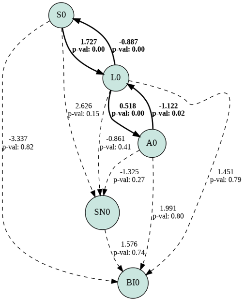 
### Results
There are significant relations between Self-efficacy and Literacy & Litercy and Attitude.


### <span style="color:blue">Lesson Learned</span>
> <span style="color:blue">Waste management knowledge (**literacy**) indeed plays a crucial role in the mix of self-believing one can be part of the environmental crusade.</span>

### Publication
*Sun, Q., Chien, S. Y., & Hsiao, I. H. (2023, July). <a href="https://doi.org/10.1109/ICALT58122.2023.00028" target="_blank">Theory of Planned Behavior Modeled Educational Technology for Waste Management Learning.</a> In 2023 IEEE International Conference on Advanced Learning Technologies (ICALT) (pp. 74-78). IEEE.*


---

## <a name="webapp"></a> Waste Genie: Web Application for Smart Waste Management & Learning

Waste Genie is a web-based application that ensembles a suite of AI, AR & Social technologies that we've researched above. It provides users the most updated waste management content and support. Waste Genie is designed to be THE go-to place and tool to get well-informed for sustainability resources, eco-tips, waste sorting feedback, etc. to adapt to our forever-growing-complex and sacred environment.

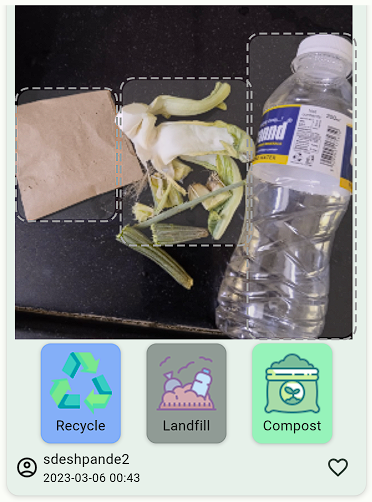  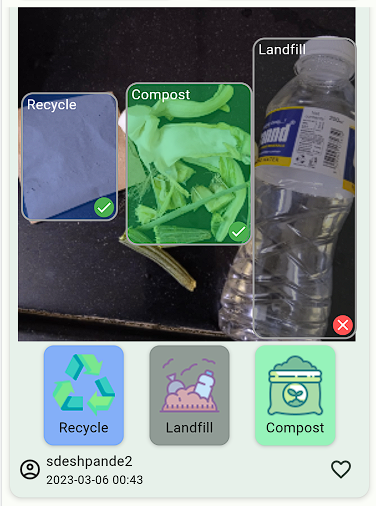 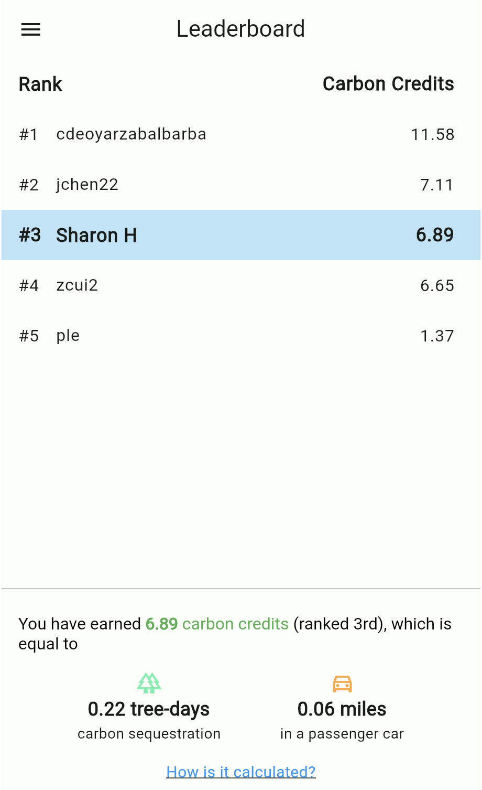 

To test the app, try it here: https://era.sqmlab.com/

### Results
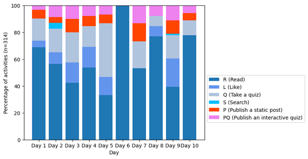 
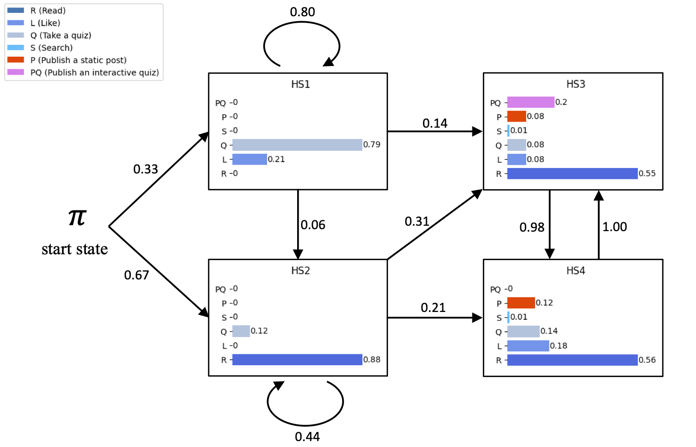 

More detail is forthcoming...

### <span style="color:blue">Lesson Learned</span>
> <span style="color:blue"> Read & interact first, publish and contribute later. 
 </span>
 
### Publication
*Sun, Q., & Hsiao, I. H. (2023, October). <a href="https://doi.org/10.1109/GHTC56179.2023.10354701" target="_blank">Waste Genie: Learning Environmental Sustainability from Waste Sorting and Interactive Feedback.</a> In 2023 IEEE Global Humanitarian Technology Conference (GHTC) (pp. 310-317). IEEE.*

*Sun., Q. & Hsiao., I-H. (2023)<a href="https://doi.org/10.1145/3586182.3616696" target="_blank"> Waste Genie: A Web-Based Educational Technology for Sustainable Waste Management</a>, In Poster Proceedings of the Annual ACM Symposium on User Interface Software and Technology (UIST 2023)*

*Sun, Q., Hsiao, S.  (2024). Supporting Informal Sustainability Learning with AI-assisted Educational Technology. In: Tareq Ahram and Waldemar Karwowski (eds) Human Factors in Design, Engineering, and Computing. AHFE (2024) International Conference. AHFE Open Access, vol 159. AHFE International, USA.
https://doi.org/10.54941/ahfe1005567*

*Sun., Q. & Hsiao., I-H. (2025) <a href="https://doi.org/10.1080/10494820.2025.2484644" target="_blank"> Waste Genie: Emerging Technology Support and Interactive Feedback to Enhance Sustainable Waste Management Learning</a>, Journal of Interactive Learning Environments, 1-18.*


## <a name="gpt"></a> AI in Waste Genie

```
RQ1: How do we create meaningful sustainability learning content, and sustainably?
RQ2: What are the alternative UI to interact with AI agent? (considering the waste mgt field is so immense, the vocabulary and pre-knowledge may be limmtied.)
RQ3: How do we engineer a location-based legislation-guided LLM (llLLM) to assist educational content generation in WG? 
```

We are experimenting and evaluating *Expert*, *Crowdsourcing* and *AI* approaches to create content, specifically, how LLM can be capitalized in creating sustainability learning content, and is the method sustainable?  

We experimented the open source LLM applications, chatGPT 3.5 Turbo, meta's LLaMA2, etc, the results are either not correct or too generic, and most importantly, not location specific. The straighforward solution is to integrate all the legal documents (legislative regulations about waste) into the LLM, however, it also indicates a severe hulucination of the model.

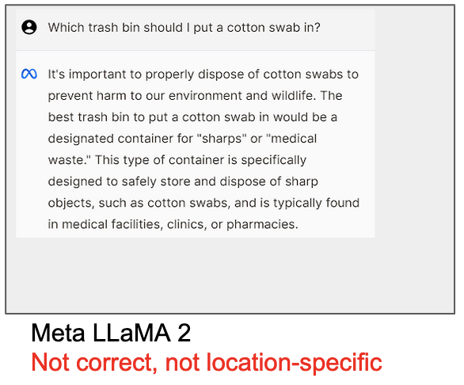
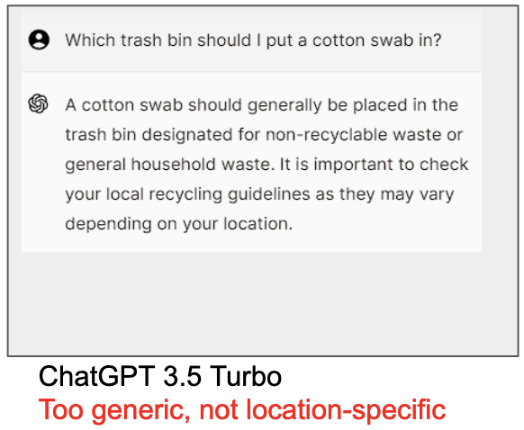

We also experimented engineering Environmental Legislative-guided LLM to help extract relevant information. Please refer to our IEEE CAI'25 & ACM COMPASS'25 papers.
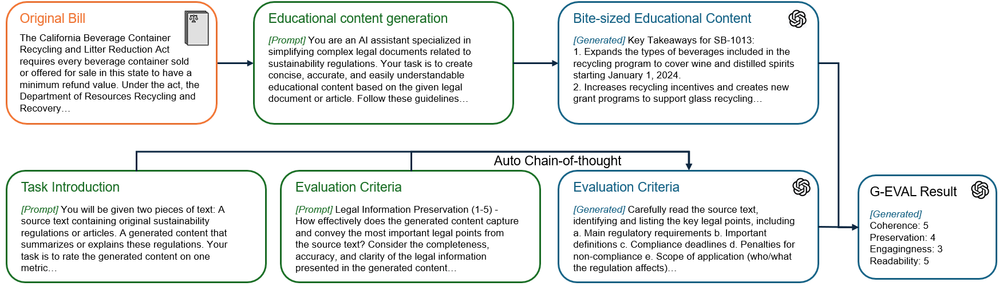
Environmental Legislative-guided LLM for Content generation and evaluation pipeline.


### Publication

*Sun., Q., Chien., S-Y. & Hsiao., I-H.(2024) <a href="https://drive.google.com/file/d/1NRjyKmSUasnrqWF_CcIq62eE" target="_blank">Learning Waste Management from Interactive Quizzes and Adaptive GPT-guided Feedback</a>, EDM workshop on Leveraging Large Language Models for Next Generation Educational Technologies, the 17th International Conference of Educational Data Mining.*

*Sun., Q. & Hsiao., I-H.(2024) <a href="https://dl.acm.org/doi/abs/10.1145/3677525.3678652" target="_blank">An AI-infused Educational Technology to Cultivate Self-directed Learning in Sustainable Waste Management</a>, GoodIT '24: Proceedings of the 2024 International Conference on Information Technology for Social Good.*

*Sun., Q. & Hsiao., I-H.(2025) <a href="https://dl.acm.org/doi/pdf/10.1109/CAI64502.2025.00066" target="_blank">Engineering Legislative-guided LLM to Support Waste Management Learning</a>, IEEE CAI'25.*

*Sun, Q., Chien, S. Y., & Hsiao, I. H. (2025, July). [Learning Reduce & Reuse Waste Management Practices with Human-AI Collaboration](https://ieeexplore.ieee.org/stamp/stamp.jsp?arnumber=11194808). In 2025 IEEE International Conference on Advanced Learning Technologies (ICALT) (pp. 254-258). IEEE.*

*Sun., Q. & Hsiao., I-H.(2025) <a href="https://dl.acm.org/doi/pdf/10.1145/3715335.3735473" target="_blank">AI-infused Educational Technology for Continuous Waste Management
Learning: an Environmental Legislative-guided LLM enhanced approach</a>, ACM SIGCAS&SIGCHI COMPASS.*


*Sun, Q., & Hsiao, I. H. (2026). <a href="https://www.jstor.org/stable/48853596" target="_blank">Lessons learned from an AI-assisted educational technology for environmental sustainability and waste management</a>. Educational Technology & Society, 29(1), 388-407.*

# <a name="AI"></a> Sustainability Content Engineering

### Crowdsourcing

Some memes are discovered in our user generated content. We later explore how AI can help generating engaging memes. Check our pubs. 

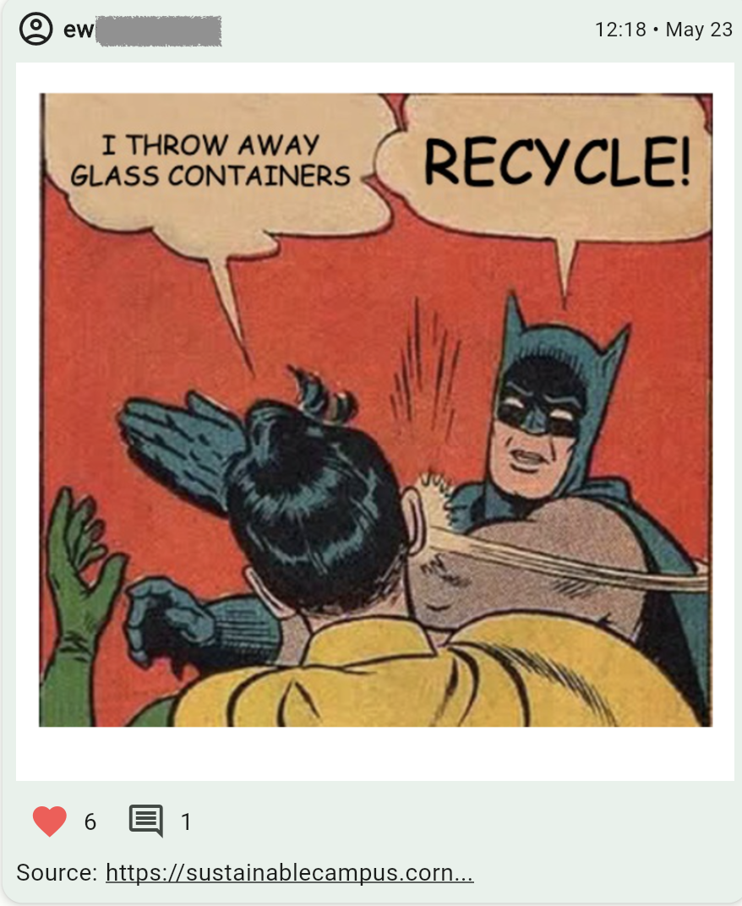

### Visualization
We engineer methods to make sustainability content more digestible and accessible via visualization. 

*Gunasekaran. M., & Hsiao, I-H. (2026, April) Making Sustainability Content Digestible: Context-Aware AI-infused Visualizations Beyond Summarization. The 13th IEEE Conference on Technologies for Sustainability (SusTech) 2026*

### Open sources
More detail is forthcoming...

## Human-AI Collaboration
We create an AI assistant that helps users express and develop ideas about sustainable practices and use a commentary interface to collaboratively generate Reduce or Reuse ideas.

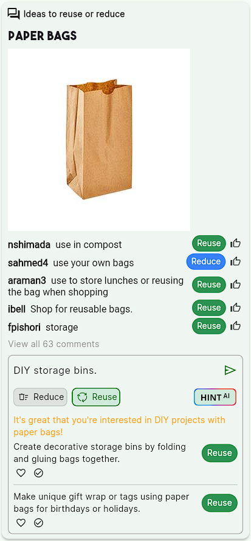

### Publication
*Sun., Q. & Hsiao., I-H.(2025) <a href="https://doi.org/10.1145/3708319.3733688" target="_blank">Human-AI Collaborated Ideation for Learning Reduce & Reuse Waste</a>, ACM UMAP LBR. The 33rd ACM International Conference on
User Modeling, Adaptation and Personalization. [<a href="https://webpages.scu.edu/ftp/ihsiao/Research/UMAP25_LBR_Hsiao.pdf" target="_blank">slide</a>]*

## Generative AI
We experimented many methods and off-the-shelf LLMs to generate educational content for WG. No matter static or interactive posts in WG, we need massive amount of organized texts, engaging imagery, clear background, and most importantly, the meta data for the post (i.e. waste sorting labels, regulations, etc.) 

Couple studies are under way, i.e. the effects of GPT-feedback in learning. 


Stay tuned...

### Publication

*Nickel, R., Hsiao, S.  (2024). [Creative Collaborator: AI-facilitated UI for Creating Engaging and Insightful Memes](https://doi.org/10.54941/ahfe1005579). In: Tareq Ahram and Waldemar Karwowski (eds) Human Factors in Design, Engineering, and Computing. AHFE (2024) International Conference. AHFE Open Access, vol 159. AHFE International, USA.
[https://doi.org/10.54941/ahfe1005579](https://doi.org/10.54941/ahfe1005579)*

## <a name="logo"></a>Waste Genie Logos
One of our talented SCU students, <a href="https://v3ceban.github.io/" " target="_blank">Vladimir Ceban</a>, designed Waste Genie logos. 
We are very pleased and proud to announce some of designs here. <br>

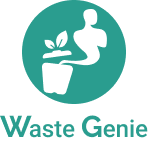


## <a name="game"></a> Gamification in informal learning


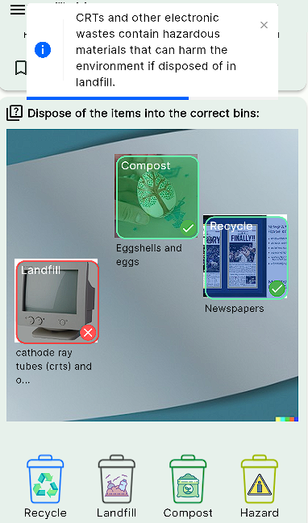
### <span style="color:blue">Lesson Learned</span>
<span style="color:blue">Concentrated mini-practices with AI-infused feedback (GPT-3.5) efficiently improved users' waste sorting accuracy. vs. practice on their own. </span>

<span style="color:blue"><b>Landfill</b> category is the main category that users struggle to sort!</span>

*<i>We have more games on deck, stay tuned...</i>


### Publication
*Sun, Q., & Hsiao, I. H. (2024, October). <a href="https://link.springer.com/chapter/10.1007/978-3-031-74138-8_11" target="_blank">Serious Practices for Interactive Waste Sorting Mini-game</a>. In Joint International Conference on Serious Games (pp. 134-141). Cham: Springer Nature Switzerland.*


---

## <a name="myecopal"></a> MyEcoPal 


As our team explore more and more about EdTech to support sustainability, we face one of the critical challenge, which is the "*gap*" between _knowing and doing_. So we begin to research methods to support sustainable actions. One of the assumptions that we tested is CO2 is colorless, odorless, tasteless. *Will you care more if you can see it?* If we associate it with the metrics you know (such as "**money**"), *will you care more?*


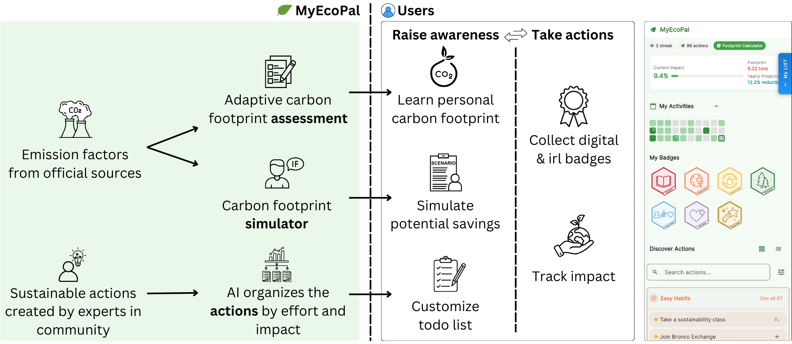


### <a href="https://youtu.be/YS-Q7yWFQGM?si=UOFJsCe9pfPMjccj" target="_blank">MyEcoPal short video intro</a> 

* MyEcoPal is also featured in the <a href="https://scu-sustech.vercel.app/" target="_blank">**Greenovation Lab: AI for Sustainability**</a>. 

* Two media articles about our project are also mentioning us. One is featured on SCU's homepage: [A team of computer scientists build an AI-powered app that encourages eco-friendly living](https://www.scu.edu/news-and-events/feature-stories/2025-feature-stories/stories/a-team-of-computer-scientists-build-an-ai-powered-app-that-encourages-eco-friendly-living.html); the other one is an interview by a third party organization, Waste Dive ([Cities and facility operators turn to AI for recycling education revamp](https://www.wastedive.com/news/ai-recycling-education-oscar-sort-professor-green-los-angeles/756106/)).

* During our exploration of *bridging the gap between knowing and doing* in MyEcoPal, we also learn many approaches to faciliate and to motivate the positive behavior change, habit building, and complex decision making. Stay tuned...


### Publication
*Sun, Q., Hsiao, I. H. & Chien, S-Y. (2026, April). <a href="https://hci-terra.github.io/assets/submissions/CHI_2026_HCI_TERRA_Personalized_Sustainability.pdf" target="_blank">Personalized Sustainability Assistant: AI-infused Context Engineering to Connect Sustainability Understanding to Sustainable Actions.</a>. In CHI'26 Workshop, <a href="https://hci-terra.github.io/" target="_blank">HCI-TERRA: HCI Towards EnviRonmentally Responsible AI. </a>*


##<a name="contacts"></a>Contacts
Qiming Sun & [Dr. Sharon Hsiao](https://webpages.scu.edu/ftp/ihsiao/)
<br><br>
<br>
We presented WG work in 2023 ACM UIST conf. 


